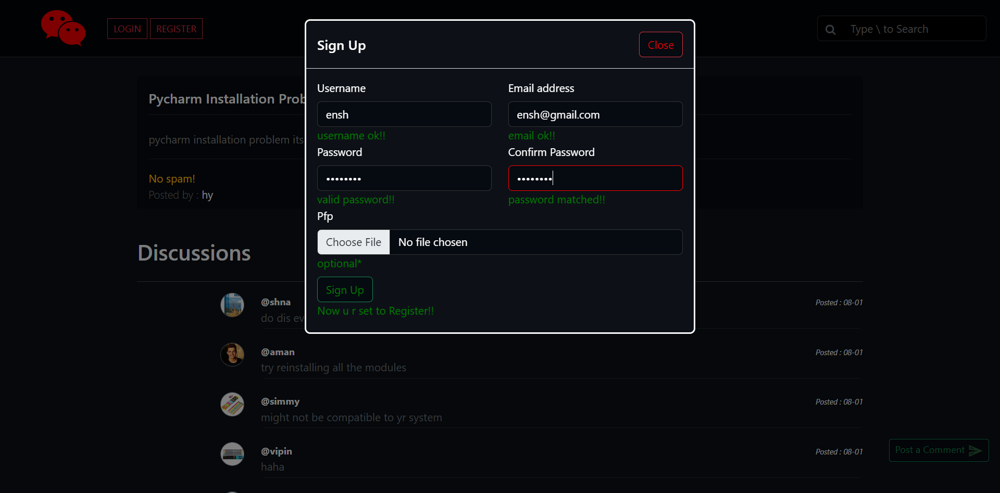

# IDiscuss PHP Project :-

This is a simple php project in which users can ask programming related questions and users can answer others question.

## Similar websites are :-

stackoverflow.com, reddit.com

## Screenshots :-

#### Home page -1

#### Home page -2

#### Signin page

#### Signup page

#### Home page[After sign in]

#### User-profile page

#### About page

#### Contact page

#### threads page

#### comments page

### Demo

IDiscuss prjoect link - *https://idiscuss.free.nf/*
